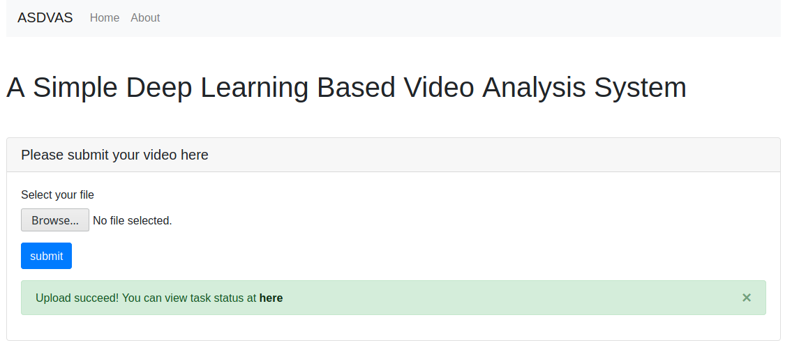
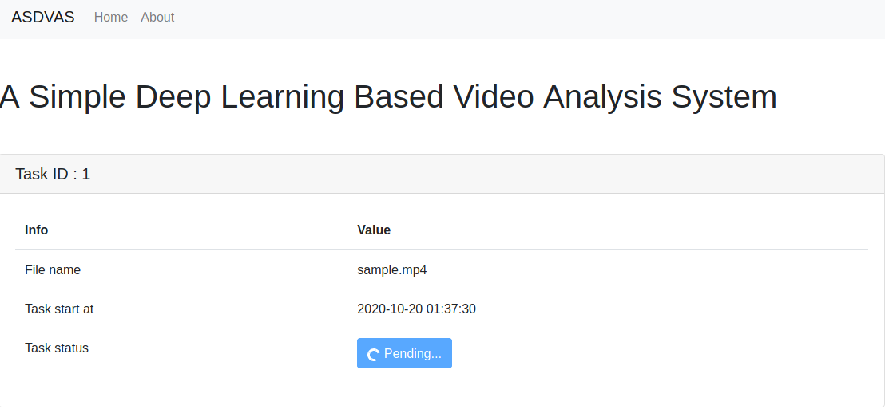
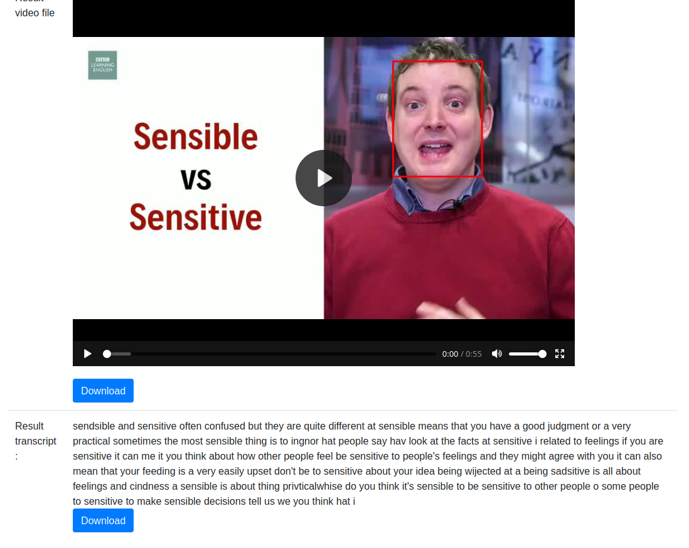

# simple-deep-learning-based-video-analysis-system
A simple video analysis system for coding test

## 1. Introduction
Flask + sqlLite + Celery

This is a simple video analysis system with both front-end and  back-end.

In the front-end, user can upload their video(only support .mp4, .flv, .mkv within 50MB). 

After submitting the video, a task number will be generated and will be sent to task queue. 

The video and audio will be extracted with ffmpeg and sent into different models, for video the human face will be detected and circled(not completed yet), 
for audio the english transcript will be extracted generated.

when the process finishes, the status of this task will be marked as finished and the new generated transcript will be available to download


## 2. Installation and usage

### 2.1 downlaod model file
Download pretrained model from
https://github.com/mozilla/DeepSpeech/releases/download/v0.8.2/deepspeech-0.8.2-models.tflite
and save it into `models` folder

### 2.2  start rabbitmq
```bash
sudo rabbitmq-server
```

### 2.3 start celery

```bash
celery -A flaskr.task.celery_app worker
```

### 2.3 init the database and run flask

```bash
export FLASK_APP=flaskr 
export FLASK_ENV=development
flask init-db
flask run
```

## 3. screenshots

### 3.1 Main page
After uploading a  video file, a link to task will be present



The processing will last few minutes



Task page will automatically refresh every 30 seconds, 
after task finished, the result transcript will be present and available to download



## 4. To be improved

1. Restriction on the video user could upload
2. Paralleling the workers
3. Use docker-compose instead of single dockerfile
4. login and sign in with email validation support
5. notice user when task finishes by email
6. Add upload progress bar
7. Add agree to terms and conditions part
8. Add detailed tutorial
9. Add video preview html part

## 5. Tips on accelerate the process
1. use ffmpeg command to handle video and audio file, especially remove the silence part of the audio
2. use lightweight pretrained models, load model once only.
3. limits the max video size to be processed
4. 

## References
1. DeepSpeech https://github.com/mozilla/DeepSpeech
2. Celery - Distributed Task Queue https://github.com/celery/celery
3. Flask official tutorial https://flask.palletsprojects.com/en/1.1.x/tutorial/#tutorial
4. Flask tutorial by pythonise https://pythonise.com/series/learning-flask
5. Jinja documentation https://jinja.palletsprojects.com/en/2.10.x/
6. bootstrap documentation https://getbootstrap.com/
7. Generate Subtitles for any video file using Mozilla DeepSpeech https://towardsdatascience.com/generating-subtitles-automatically-using-mozilla-deepspeech-562c633936a7